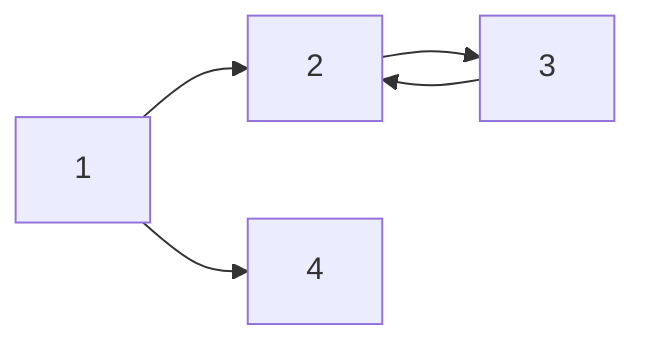

\#은 Header를 의미합니다.

# H1 태그

## H2 Tag

### H3 Tag

#### H4 Tag

\#을 5개 이상 쓴다는 것? -> 잘못된 분류!!

---

\*\* 기울임체

_hllle_

_italic_

**bold**

**_italic+bold_**

~~hello~~

> 안녕하세요 이건 Quote 입니다.

> 오늘 너무 힘들다 - 김태송

---

- list 1
- list 2
- list 3

* list 1
* list 2
* list 3
  - A
    - B

- **무결성** :

1. list 1
2. list 2
3. list 3
   1. A
      1. B

| 제목 | description | 비교 |
| ---- | ----------- | ---- |
| 안녕 | 1           | 2    |
| 할로 | 3           | 4    |

---

[링크이름](naver.com)

<a href="naver.com">링크이름</a>


---

`simple code`

```python
for i in range(1, 10):
    print('hi')
```

```sh

```

---

$a+b=c$

$ a^2_1 + b^2 = c^2$

$$(\alpha + \beta)^2 = \alpha^2 + 2 \alpha \beta + \beta^2$$

$$min_Gmax_D$$

$\alpha \beta \frac{1}{2}$

---


